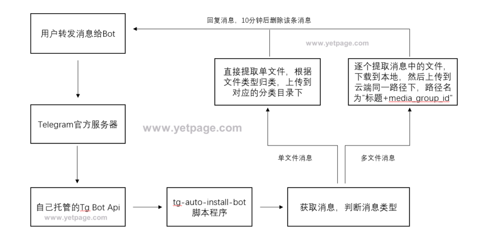

# 介绍
一个简单的自动转存文件的telegram机器人，直接将消息转发给机器人，机器人自动提取文件，不限速下载消息中所有文件到本地，然后调用rclone上传文件到云端，完成后回复"xx文件下载完成+alist等列表程序访问该文件的地址"的消息（10分钟后删除该条回复的消息）。需借助自建的telegram bot api，官方api有文件大小限制.

Github项目地址：tg-auto-install-bot

文件保存路径与重命名
单文件消息：根目录下，按照video、document、audio、photo分类保存

多文件消息：media_group目录下，再创建一个以“标题+media_group_id”的子目录保存一条消息中的所有文件

文件重命名：

所有文件的文件名后缀前都会追加文件大小
若原有文件名全部为英文字符或不存在，截取消息标题前40个字符为文件名，若标题也不存在，使用分类名为文件名
由于很多tg文件其实不存在文件名称，或者全为英文乱码，故默认开启文件重命名

使用方法
用户将消息转发给机器人或发送文件给机器人，机器人自动、提取下载消息中的文件；

将机器人拉入群组，设置为管理员，机器人即可自动提取、下载所有新发布的或新转入群组的消息中的文件。

查看Bot状态： 发送/ping或者/start命令，若机器人正常工作，会回复"Pong! 🏓"，2秒后会删除消息

工作流程图

